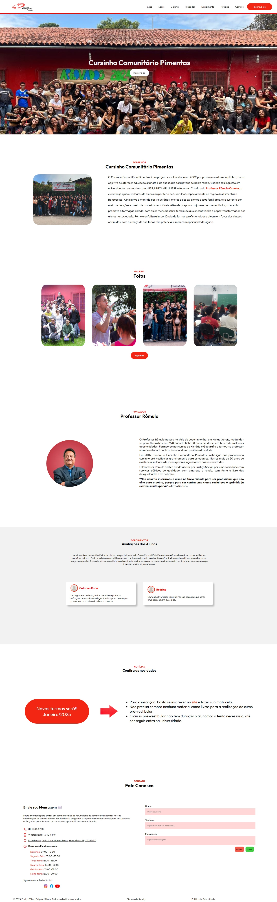

# Projeto Web Standards – Cursinho Comunitário Pimentas  

## Sobre o Projeto  
Durante o curso na Faculdade ENIAC, eu e meu grupo desenvolvemos o **Projeto Web Standards**, com o objetivo de criar um site funcional e responsivo para o **Cursinho Comunitário Pimentas**. Esse cursinho é uma iniciativa social que oferece educação gratuita e de qualidade para jovens de baixa renda, preparando-os para o ingresso em universidades renomadas.  

---

## Funcionalidades do Site  

- **Banco de Dados Integrado:**  
   O site utiliza um banco de dados hospedado localmente no **XAMPP**, com gerenciamento via **phpMyAdmin**. A aplicação se conecta ao banco de dados por meio do endereço `localhost`, possibilitando:  
  - Armazenamento e gerenciamento das inscrições dos estudantes.   

- **Seções Informativas:**  
  - História do cursinho e sua missão.  
  - Depoimentos de alunos que destacam o impacto do projeto em suas vidas.  
  - Informações sobre o fundador, Professor Rômulo Ornelas.  

- **Notícias e Atualizações:**  
  Uma área dedicada a novidades, como abertura de novas turmas, eventos e comunicados importantes.  

- **Galeria de Fotos:**  
  Apresenta momentos marcantes e registros fotográficos das atividades realizadas pelo cursinho.  

- **Contato Direto:**  
  Inclui um formulário de contato, além de informações de endereço, telefone e redes sociais, facilitando a comunicação com a instituição.  

## Impacto e Objetivo  
O site foi desenvolvido com foco em:  
- **Acessibilidade para os Jovens:** Promovendo o acesso fácil a informações e inscrições para o cursinho.  
- **Divulgação do Projeto:** Aumentando a visibilidade do cursinho para atrair novos voluntários e doadores.  
- **Sustentabilidade Digital:** Fornecendo uma plataforma moderna que reflete a importância do projeto social.  

Além disso, o site reforça a missão do **Cursinho Comunitário Pimentas**, de promover transformação social e oferecer oportunidades iguais para jovens da periferia.  
---

## Nossa Contribuição  
O desenvolvimento do site foi uma experiência enriquecedora, que envolveu:  
- Levantamento das necessidades da instituição e de seu público-alvo.  
- Trabalho em equipe e aplicação prática dos conceitos aprendidos durante o curso.  

### Equipe  
Desenvolvido por:  
- **Emilly**  
- **Fábio**  
- **Felipe**  
- **Milena**

## Site Cursinho Comunitário Pimentas

